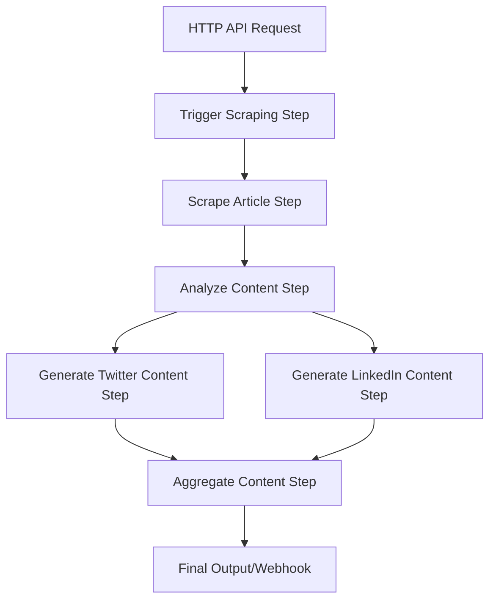

# Content Writing Agent - Project Overview

## 🎯 Project Purpose

This project is an AI-powered content writing agent built with the Motia platform that automatically:

1. **Scrapes content** from web articles
2. **Analyzes the content** using AI to understand themes, audience, and viral potential
3. **Generates optimized social media content** for Twitter and LinkedIn platforms

## 🏗️ Architecture Overview

The system uses Motia's event-driven architecture with the following components:



## 📁 Project Structure

```
content-writing-agent/
├── steps/                          # Motia workflow steps
│   ├── triggerScraping.step.js     # API endpoint for starting process
│   ├── scrapeArticle.step.js       # Web scraping logic
│   ├── analyzeContent.step.js      # AI content analysis
│   ├── generateTwitterContent.step.js  # Twitter content generation
│   ├── generateLinkedInContent.step.js # LinkedIn content generation
│   └── aggregateContent.step.js    # Final result aggregation
├── types/                          # TypeScript type definitions
│   └── events.ts                   # Event schema definitions
├── config/                         # Configuration management
│   └── index.js                    # Environment and settings
├── docs/                           # Documentation
│   └── api.md                      # API documentation
├── examples/                       # Usage examples
│   └── sample-request.json         # Sample API request
├── package.json                    # Dependencies and scripts
├── setup.js                        # Interactive setup script
├── .env.example                    # Environment variables template
└── README.md                       # Main documentation
```

## 🔄 Event Flow

The system uses the following event topics to connect steps:

1. **`scrape-article`** - Triggered by API, contains URL and options
2. **`article-scraped`** - Contains extracted article content
3. **`content-analyzed`** - Contains AI analysis results
4. **`twitter-content-generated`** - Contains generated Twitter posts
5. **`linkedin-content-generated`** - Contains generated LinkedIn posts
6. **`content-aggregated`** - Contains final combined results
7. **`processing-error`** - Error handling across all steps

## 🛠️ Key Technologies

- **[Motia](https://motia.dev)** - Event-driven workflow framework
- **OpenAI GPT-4** - Content analysis and generation
- **Puppeteer** - Dynamic web scraping
- **Cheerio** - Static HTML parsing
- **Axios** - HTTP requests
- **Node.js** - Runtime environment

## 🚀 Getting Started

### Quick Setup

1. **Clone and navigate**:
   ```bash
   cd content-writing-agent
   ```

2. **Install dependencies**:
   ```bash
   npm install
   ```

3. **Run interactive setup**:
   ```bash
   npm run setup
   ```

4. **Start development server**:
   ```bash
   npm run dev
   ```

5. **Open Motia Workbench**:
   Navigate to `http://localhost:3000`

### Manual Setup

1. Copy environment template:
   ```bash
   cp .env.example .env
   ```

2. Edit `.env` with your OpenAI API key:
   ```env
   OPENAI_API_KEY=your_key_here
   ```

3. Start the server:
   ```bash
   npm run dev
   ```

## 📡 API Usage

### Generate Content

**Endpoint**: `POST /api/generate-content`

**Request**:
```json
{
  "url": "https://example.com/article",
  "options": {
    "timeout": 30000
  }
}
```

**Response**:
```json
{
  "message": "Content generation started",
  "requestId": "uuid-here",
  "status": "processing",
  "estimatedProcessingTime": "2-3 minutes"
}
```

### Example Usage

```bash
curl -X POST http://localhost:3000/api/generate-content \
  -H "Content-Type: application/json" \
  -d '{"url": "https://techcrunch.com/2024/01/15/ai-article"}'
```

## 🎨 Generated Content Examples

### Twitter Output
```json
{
  "tweets": [
    {
      "text": "🚀 AI is transforming how we work. Here's what you need to know...",
      "hashtags": ["#AI", "#Technology", "#Future"],
      "characterCount": 245,
      "type": "single"
    }
  ],
  "engagementHooks": ["Question hook", "Stat hook"],
  "bestPostingTimes": ["9-10 AM EST", "7-8 PM EST"]
}
```

### LinkedIn Output
```json
{
  "post": "The future of work is being reshaped by AI...\n\nKey insights:\n• Automation is accelerating\n• New skills are emerging\n• Adaptation is crucial\n\nWhat's your experience with AI in your industry?",
  "hashtags": ["#ArtificialIntelligence", "#FutureOfWork"],
  "characterCount": 1847,
  "callToAction": "What's your experience with AI in your industry?"
}
```

## 🔧 Configuration Options

### Environment Variables

| Variable | Description | Default |
|----------|-------------|---------|
| `OPENAI_API_KEY` | OpenAI API key (required) | - |
| `OPENAI_MODEL` | AI model to use | `gpt-4` |
| `CONTENT_TEMPERATURE` | AI creativity (0-1) | `0.7` |
| `MAX_TWEET_LENGTH` | Twitter character limit | `280` |
| `MAX_LINKEDIN_LENGTH` | LinkedIn character limit | `3000` |
| `REQUEST_TIMEOUT` | Scraping timeout (ms) | `30000` |
| `MOTIA_PORT` | Server port | `3000` |
| `WEBHOOK_URL` | Results webhook (optional) | - |

### Scraping Options

```json
{
  "url": "https://example.com/article",
  "options": {
    "timeout": 45000,
    "waitForSelector": ".article-content",
    "userAgent": "Custom User Agent"
  }
}
```

## 🎯 Use Cases

- **Content Marketers**: Repurpose blog articles into social media content
- **Social Media Managers**: Generate platform-specific content from news
- **Bloggers**: Create promotional content for articles
- **Agencies**: Scale content creation for multiple clients
- **News Organizations**: Automate social media post creation

## 🔍 Monitoring & Debugging

### Motia Workbench Features

- **Visual Flow Diagram**: See your workflow as an interactive graph
- **Real-time Logs**: Monitor each step's execution
- **Event Tracking**: Follow data flow through the system
- **Performance Metrics**: Track processing times

### Logging

The system provides detailed console logging:

```bash
npm run dev

# Example logs:
# Starting to scrape article: https://example.com/article
# Successfully scraped article: "AI Breakthrough" (1,247 words)
# Content analysis completed. Main themes: AI, Technology, Innovation
# Generated 4 Twitter posts
# Generated LinkedIn post (1,847 characters)
# ✅ Content generation completed for: AI Breakthrough
```

## 🚨 Error Handling

The system includes comprehensive error handling:

- **Input Validation**: URL format and required fields
- **Scraping Failures**: Automatic retry with fallback methods
- **AI API Errors**: Graceful degradation and error reporting
- **Rate Limiting**: Built-in delays to respect API limits
- **Timeout Handling**: Automatic termination of long-running requests

## 🔗 Webhook Integration

Configure webhooks to receive completion notifications:

```env
WEBHOOK_URL=https://your-app.com/webhook
WEBHOOK_SECRET=your-secret-key
```

**Webhook Payload**:
```json
{
  "event": "content-generation-complete",
  "requestId": "uuid",
  "content": {
    "twitter": { /* Twitter content */ },
    "linkedin": { /* LinkedIn content */ }
  },
  "metadata": {
    "totalProcessingTime": 45000,
    "success": true
  }
}
```

## 🧪 Testing

```bash
# Test with sample request
curl -X POST http://localhost:3000/api/generate-content \
  -H "Content-Type: application/json" \
  -d @examples/sample-request.json
```

## 🔮 Future Enhancements

Potential improvements and extensions:

- **Multi-language Support**: Generate content in different languages
- **Custom Templates**: User-defined content templates
- **Batch Processing**: Process multiple articles simultaneously
- **Social Media Scheduling**: Direct integration with social platforms
- **Performance Analytics**: Track content engagement metrics
- **A/B Testing**: Generate multiple variations for testing
- **Content Approval Workflow**: Human review before publication
- **Brand Voice Customization**: Maintain consistent brand tone

## 🤝 Contributing

1. Fork the repository
2. Create a feature branch
3. Make your changes
4. Add tests if applicable
5. Submit a pull request

## 📄 License

MIT License - see LICENSE file for details

## 🆘 Support

- **Motia Documentation**: [motia.dev/docs](https://motia.dev/docs)
- **Community Discord**: [Motia Discord](https://discord.gg/nJFfsH5d6v)
- **Issues**: Create an issue in this repository

---

Built with ❤️ using [Motia](https://motia.dev) - The unified backend framework for APIs, Events, and AI Agents.

