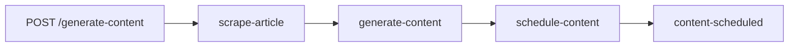

# Simple Content Agent 🚀

A streamlined content generation agent built with [Motia](https://motia.dev) that transforms articles into engaging Twitter threads and LinkedIn posts using AI.

## 🎯 Workflow Overview

**Simple 4-Step Process:**
```
API → Scrape → Generate → Schedule
```

1. **API**: Receives article URL via POST request
2. **Scrape**: Extracts content using Firecrawl in markdown format
3. **Generate**: Creates Twitter & LinkedIn content in parallel using OpenAI
4. **Schedule**: Saves content as drafts in Typefully for review

## ✨ Features

- **🔗 One-Click Processing**: Just provide an article URL
- **⚡ Parallel Generation**: Twitter and LinkedIn content created simultaneously
- **📝 Few-Shot Learning**: Uses proven examples to generate high-quality content
- **📅 Auto-Scheduling**: Content saved as drafts in Typefully
- **🎨 Platform-Optimized**: Content tailored for each platform's best practices

## 🛠️ Setup

### Prerequisites

- Node.js 18+
- API keys for:
  - [OpenAI](https://platform.openai.com/api-keys)
  - [Firecrawl](https://firecrawl.dev)
  - [Typefully](https://typefully.com/api)

### Installation

1. **Clone and navigate:**
   ```bash
   cd simple-content-agent
   ```

2. **Install dependencies:**
   ```bash
   npm install
   ```

3. **Configure environment:**
   ```bash
   cp .env.example .env
   # Edit .env with your API keys
   ```

4. **Start the agent:**
   ```bash
   npm run dev
   ```

## 🚀 Usage

### Generate Content

Send a POST request to trigger content generation:

```bash
curl -X POST http://localhost:3000/generate-content \\
  -H "Content-Type: application/json" \\
  -d '{"url": "https://example.com/article"}'
```

**Response:**
```json
{
  "message": "Content generation started",
  "requestId": "req_123456",
  "url": "https://example.com/article",
  "status": "processing"
}
```

### View Results

After processing completes:
1. Visit [Typefully](https://typefully.com/drafts)
2. Review your generated Twitter thread and LinkedIn post
3. Edit if needed and publish!

## 📋 Content Examples

### Twitter Thread Style
- **Hook**: Attention-grabbing opening statement
- **Structure**: Numbered tweets (1/n, 2/n, etc.)
- **Engagement**: Emojis, questions, and CTAs
- **Value**: Each tweet builds on the previous one
- **Closing**: Strong call-to-action

### LinkedIn Post Style
- **Professional tone** with casual elements
- **Bullet points** for easy scanning
- **Actionable insights** and practical information
- **Genuine voice** that sounds authentic
- **Clear value proposition**

## 🔧 Configuration

### Environment Variables

| Variable | Description | Required |
|----------|-------------|----------|
| `OPENAI_API_KEY` | OpenAI API key for content generation | ✅ |
| `FIRECRAWL_API_KEY` | Firecrawl API key for web scraping | ✅ |
| `TYPEFULLY_API_KEY` | Typefully API key for scheduling | ✅ |
| `MOTIA_PORT` | Port for Motia server (default: 3000) | ❌ |

### OpenAI Model

Default model: `gpt-4o`
- Optimized for creative content generation
- Supports JSON response format
- Excellent at following few-shot examples

## 📊 Event Flow



### Event Topics

- `scrape-article`: Triggers article scraping
- `generate-content`: Triggers parallel content generation
- `schedule-content`: Triggers Typefully scheduling
- `content-scheduled`: Final completion event

## 🎨 Content Generation

### Twitter Thread Generation
- Uses proven thread structure from successful examples
- Optimized for engagement and readability
- Includes proper numbering and transitions
- Incorporates relevant emojis and hashtags

### LinkedIn Post Generation
- Professional yet approachable tone
- Structured with bullet points for scanning
- Includes actionable insights
- Optimized for LinkedIn's algorithm

## 📁 Project Structure

```
simple-content-agent/
├── steps/
│   ├── api.step.ts          # API endpoint handler
│   ├── scrape.step.ts       # Firecrawl integration
│   ├── generate.step.ts     # Parallel OpenAI calls
│   └── schedule.step.ts     # Typefully scheduling
├── prompts/
│   ├── twitter-prompt.txt   # Twitter generation prompt
│   └── linkedin-prompt.txt  # LinkedIn generation prompt
├── config/
│   └── index.js            # Configuration management
├── package.json
├── tsconfig.json
└── README.md
```

## 🔍 Monitoring

The agent provides detailed logging for each step:

- **🚀 API**: Request received and processing started
- **🕷️ Scrape**: Article extraction progress
- **✍️ Generate**: Parallel content generation status
- **📅 Schedule**: Typefully draft creation
- **🎉 Complete**: Final URLs and completion status

## 🚨 Error Handling

Comprehensive error handling at each step:
- **Scraping failures**: Invalid URLs or inaccessible content
- **Generation failures**: OpenAI API issues or malformed responses
- **Scheduling failures**: Typefully API errors or authentication issues

## 🤝 Contributing

1. Fork the repository
2. Create a feature branch
3. Make your changes
4. Test thoroughly
5. Submit a pull request

## 📄 License

MIT License - see LICENSE file for details

## 🆘 Support

For issues or questions:
1. Check the logs for detailed error messages
2. Verify all API keys are correctly configured
3. Ensure all required environment variables are set
4. Review the Motia documentation at [motia.dev](https://motia.dev)

---

**Built with ❤️ using [Motia](https://motia.dev)**

